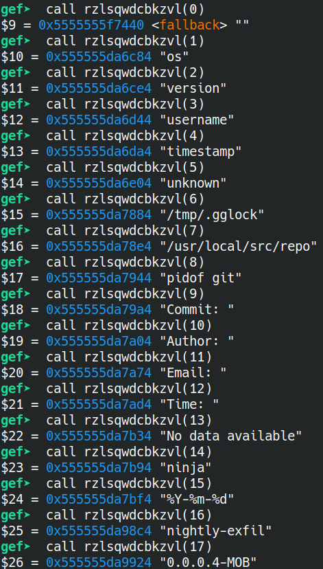
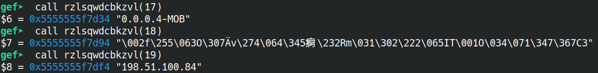

# Task 6
Now that we've found a malicious artifact, the next step is to understand what it's doing. Identify some characteristics of the communications between the malicious artifact and the LP.

## Solution
1. Open up the good ol ghidra with the file found from Task 5 (the make file)

    a. Make your way to the main function -> see gitGrabber() function and look into it

2. To find the ip -> there is a variable called "ip_00" and opening up GDB GEF, you can run `rzlsqwdcbkzvl(13)` and get the ip as `198.51.100.84`

3. To find the version number: go into other weird function -> `ospoimcwliqai` and see the "version_00" variable = `0.0.0.4-MOB`

4. To find the key (the hardest): `call rzlsqwdcbkzvl(12)`. We used 0x12 because I manually enumerated calling this deobfuscation function (after I noticed ip_00 and version_00). "0x12" converts to 18 in decimal ([ascii table reference](https://bluesock.org/~willg/dev/ascii.html)).

    - However, when you call that function, it gives you some weird gibberish:

    `$2 = 5555555f7d34 "\002f\255\063O\307Ǟv\274\064\345痾\232Rm\031\302\222\065IT\001O\034\071\347\367C3"`

    So, you have to use the GDB x command and run `x/32xb $2` and then manually copy and paste each hex into a line for the submission.

    Final submission:

    `0266ad334fc7c79e76bc34e5e97be9a526d19c292354954014f1c39e7f7433`

Reference: [GDB x commad](https://visualgdb.com/gdbreference/commands/x)

## Alternative Solution Process
Notice that this one funtion `rzlsqwdcbkzvl` takes in some int and Ghidra allows you to call functions and as you add in numbers, you find the information you want.

