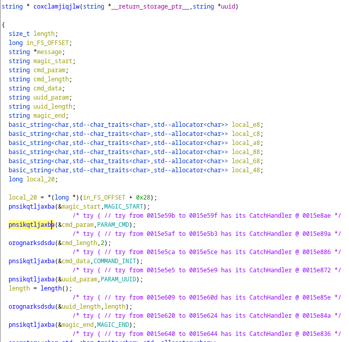
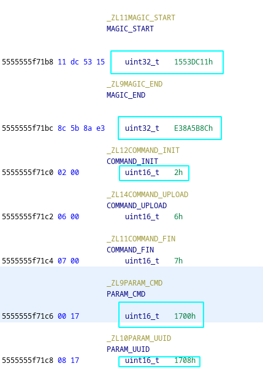
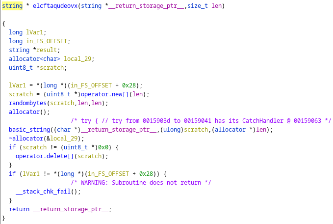

# Task 7 - SOLO
With the information provided, PANIC worked with OOPS to revert their Docker image to a build prior to the compromise. Both companies are implementing additional checks to prevent a similar attack in the future.

Meanwhile, NSA's Cybersecurity Collaboration Center is working with DC3 to put together a Cybersecurity Advisory (CSA) for the rest of the DIB. DC3 has requested additional details about the techniques, tools, and targets of the cyber actor.

To get a better understanding of the techniques being used, we need to be able to connect to the listening post. Using the knowledge and material from previous tasks, analyze the protocol clients use to communicate with the LP. Our analysts believe the protocol includes an initial crypt negotiation followed by a series of client-generated requests, which the LP responds to. Provide the plaintext a client would send to initialize a new session with the provided UUID.

Downloads:
- Victim ID to use in initialization message (victim_id)

## Solution
Gotta allocate memory for the string.

```
gef➤ call (string *) malloc(sizeof(std::string))
$3 = (std::string *) 0x555555da4e10
gef➤ call ((std::string*)0x555555da4e10)->basic_string()
gef➤ call ((std::string*)0x555555da4e10)->assign
("4da468db-1daa-481c-9be7-d9feee42a436")
$4 = (std::__cxx11::basic_string<char, std::char_traits<char>, std::allocator<char> > &) @0x555555da4e10: {
  static npos = 0xffffffffffffffff,
  _M_dataplus = {
    <std::allocator<char>> = {
      <__gnu_cxx::new_allocator<char>> = {<No data fields>}, <No data fields>}, 
    members of std::__cxx11::basic_string<char, std::char_traits<char>, std::allocator<char> >::_Alloc_hider:
    _M_p = 0x555555da4e70 "4da468db-1daa-481c-9be7-d9feee42a436"
  },
  _M_string_length = 0x24,
  {
    _M_local_buf = "$", '\000' <repeats 14 times>,
    _M_allocated_capacity = 0x24
  }
}
```

Now we can call the function that allocates it with the UUID...

```
gef➤ call elcftaqudeovx(*(const std::string*)0x555555da4e10,0x10)
$9 = {
  static npos = 0xffffffffffffffff,
  _M_dataplus = {
    <std::allocator<char>> = {
      <__gnu_cxx::new_allocator<char>> = {<No data fields>}, <No data fields>}, 
    members of std::__cxx11::basic_string<char, std::char_traits<char>, std::allocator<char> >::_Alloc_hider:
    _M_p = 0x7fffffffddf0 ""
  },
  _M_string_length = 0x0,
  {
    _M_local_buf = '\000' <repeats 15 times>,
    _M_allocated_capacity = 0x0
  }
}
```

BUT alas, that function actually just overwrites it so fuck that. So we must just rewrite where that _M_p pointer is and put the memory address of the UUID -> `set *$9._M_dataplus._M_p = 0x555555da4e10`

Where does the UUID get used other than the above (elcftaqudeovx)?

`string * coxclamjiqjlw(string *__return_storage_ptr__,string *uuid)`

Before we can call that function, it takes in a `__return_storage_ptr__`. Then can do that

```
gef➤ call (string *) malloc(sizeof(std::string))
$10 = (std::string *) 0x555555da4db0
```

Calling the function was not fucking working, so I gotta edit the register and fuck with it.

`set $rbp-0x1a8 = 0x555555da4db0`

NOW, we can call the function again and hopefully get the freaking answer.

`call (std::string *) (*0x5555555b2545(*0x555555da4db0,*0x555555da4e10))`

Yeah so all that did not work so I instead did it statically.

## Static Solve
Look at what everything is set to in ghidra within that function.





Alternatively, you can click on the function that is taking in that variable and see what the size is (like `pnsikqtljaxba(&cmd_param,PARAM_CMD)`). You have to note down the size in order to correctly convert it to bytes and then back to a hex string/dump. We have to convert to bytes because that is what the program is doing to then send it to start the connection. We noticed this back when we saw how the UUID gets constructed. In the picture below, we see randombytes() so that tells us that there is a conversion of bytes.



The parts that are sent are now defined below with the correct byte sizes.
```
magic_start: 1553DC11
cmd_param: 1700
cmd_length: 0002
cmd_data: 0002
uuid_param: 1708
uuid_length: 0010
uuid: b'M\xa4h\xdb\x1d\xaaH\x1c\x9b\xe7\xd9\xfe\xeeB\xa46'
magic_end: E38A5B8C
```

Then convert that to hex (in the convert.py script) and we get the hex dump :).

`1553dc11170000020002170800104da468db1daa481c9be7d9feee42a436e38a5b8c`


